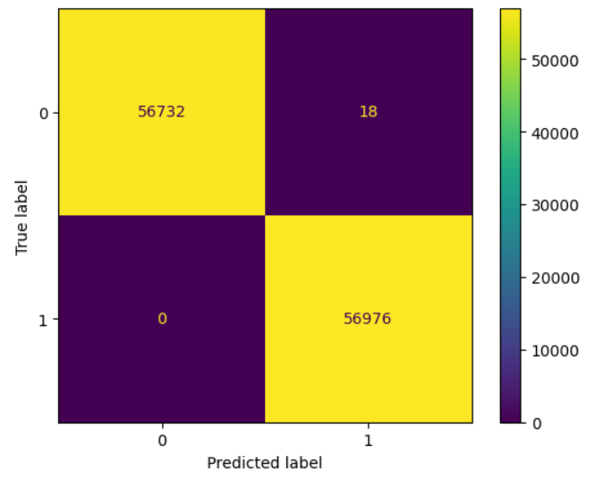

# Análisis predictivo para la detección de fraudes en transacciones bancarias

## Antecedentes y visión general

SecureSwipe Solutions es una empresa de tecnología financiera en rápido crecimiento que presta servicios
 de procesamiento de pagos a comerciantes en línea y tiendas físicas de toda Europa. Fundada en 2020,
 la compañía ha experimentado un crecimiento exponencial, procesando cientos de miles de
 transacciones al mes. Sin embargo, con este crecimiento, SecureSwipe ha identificado un alarmante
 aumento en las transacciones fraudulentas, que está causando pérdidas financieras y dañando
 la reputación de la compañía entre sus clientes comerciales.

El actual sistema de detección del fraude en SecureSwipe se basa en reglas estáticas y está 
demostrando ser inadecuado para identificar patrones sofisticados de fraude. La empresa ha
 observado que los estafadores están adaptando sus técnicas más rápido de lo que las 
actualizaciones manuales de reglas pueden seguir. Esto ha dado lugar a falsos 
positivos (transacciones legítimas marcadas como fraudulentas) y falsos
 negativos (transacciones fraudulentas que no se detectan).

Para abordar estos desafíos, el liderazgo de SecureSwipe ha decidido implementar un sistema
 más avanzado y basado en datos de detección de fraude que utiliza 
técnicas de aprendizaje automático. Creen que al aprovechar la gran cantidad de datos 
de transacciones que han acumulado, pueden crear un modelo de detección de fraude más preciso y adaptable.

Este proyecto analiza los datos de transacciones para el entrenamiento de un modelo de aprendizaje automático, que
predicirá si una transacción es fraudulenta o legítima.

El conjunto de datos utilizado es de transacciones reales anonimizadas realizadas por usuarios en Europa. Aquí
se encuentran los [datos](https://www.kaggle.com/datasets/nelgiriyewithana/credit-card-fraud-detection-dataset-2023).

### Estructura de datos y exploraciones iniciales

SecureSwipe Solutions tiene 568,630 transacciones de tarjetas de crédito realizadas por titulares de tarjetas europeos
 en 2023. Contiene 31 características, divididas en cuatro grupos. El primero identifica de manera única una transacción
 y solo incluye la columna `id`. El segundo grupo contiene casi todos los predictores (28 características) pero
 anonimizados (`V1`, `V2`,..., `V28`). El tercer grupo representa el monto de la transacción en euros (`Amount`). El grupo
 final es la característica objetivo (`Clase`) utilizando una etiqueta binaria que indica si la transacción es fraudulenta (1) o no (0).
La siguiente tabla ilustra esto:

| Característica | Propósito                                                                                   |
|----------------|---------------------------------------------------------------------------------------------|
| id             | Un identificador único para cada registro en el conjunto de datos                          |
| V1             | Características anonimizadas que representan varios atributos de transacción. (ej.: tiempo, localización, etc.) |
| V2             | Características anonimizadas que representan varios atributos de transacción. (ej.: tiempo, localización, etc.) |
| V3             | Características anonimizadas que representan varios atributos de transacción. (ej.: tiempo, localización, etc.) |
| V4             | Características anonimizadas que representan varios atributos de transacción. (ej.: tiempo, localización, etc.) |
| V5             | Características anonimizadas que representan varios atributos de transacción. (ej.: tiempo, localización, etc.) |
| V6             | Características anonimizadas que representan varios atributos de transacción. (ej.: tiempo, localización, etc.) |
| V7             | Características anonimizadas que representan varios atributos de transacción. (ej.: tiempo, localización, etc.) |
| V8             | Características anonimizadas que representan varios atributos de transacción. (ej.: tiempo, localización, etc.) |
| V9             | Características anonimizadas que representan varios atributos de transacción. (ej.: tiempo, localización, etc.) |
| V10            | Características anonimizadas que representan varios atributos de transacción. (ej.: tiempo, localización, etc.) |
| V11            | Características anonimizadas que representan varios atributos de transacción. (ej.: tiempo, localización, etc.) |
| V12            | Características anonimizadas que representan varios atributos de transacción. (ej.: tiempo, localización, etc.) |
| V13            | Características anonimizadas que representan varios atributos de transacción. (ej.: tiempo, localización, etc.) |
| V14            | Características anonimizadas que representan varios atributos de transacción. (ej.: tiempo, localización, etc.) |
| V15            | Características anonimizadas que representan varios atributos de transacción. (ej.: tiempo, localización, etc.) |
| V16            | Características anonimizadas que representan varios atributos de transacción. (ej.: tiempo, localización, etc.) |
| V17            | Características anonimizadas que representan varios atributos de transacción. (ej.: tiempo, localización, etc.) |
| V18            | Características anonimizadas que representan varios atributos de transacción. (ej.: tiempo, localización, etc.) |
| V19            | Características anonimizadas que representan varios atributos de transacción. (ej.: tiempo, localización, etc.) |
| V20            | Características anonimizadas que representan varios atributos de transacción. (ej.: tiempo, localización, etc.) |
| V21            | Características anonimizadas que representan varios atributos de transacción. (ej.: tiempo, localización, etc.) |
| V22            | Características anonimizadas que representan varios atributos de transacción. (ej.: tiempo, localización, etc.) |
| V23            | Características anonimizadas que representan varios atributos de transacción. (ej.: tiempo, localización, etc.) |
| V24            | Características anonimizadas que representan varios atributos de transacción. (ej.: tiempo, localización, etc.) |
| V25            | Características anonimizadas que representan varios atributos de transacción. (ej.: tiempo, localización, etc.) |
| V26            | Características anonimizadas que representan varios atributos de transacción. (ej.: tiempo, localización, etc.) |
| V27            | Características anonimizadas que representan varios atributos de transacción. (ej.: tiempo, localización, etc.) |
| V28            | Características anonimizadas que representan varios atributos de transacción. (ej.: tiempo, localización, etc.) |
| Amount         | Monto de la transacción en euros                                                         |
| Class          | Etiqueta binaria que indica si la transacción es fraudulenta (1) o no (0)               |

El informe detallado se puede encontrar en [Kaggle](https://www.kaggle.com/code/christianmontenegro/detecci-n-de-fraudes-en-transacciones).
El modelo de proceso de estándar abierto usado es [CRISP-DM](https://www.datascience-pm.com/crisp-dm-2/).

## Resumen ejecutivo

### Visión general de descubrimientos

El modelo entrenado logra generalización al obtener excelentes resultados en diferentes métricas de rendimiento relevantes. El modelo también
tiene la capacidad de interpretabilidad al explicar como realiza la toma de decisiones para dar una predicción. En las siguientes
secciones se detallará esto.

### Rendimiento

El modelo obtuvo excelentes rendimientos, al utilizar AUC-ROC, sensibilidad, precisión y F1. Las puntuaciones fueron 0.99, 1, 0.99 y 0.99, respectivamente. Otro
 método para evaluar nuestro modelo implicó el uso de la matriz de confusión. La matriz de confusión indicó 22 falsos positivos, un número relativamente pequeño
 en comparación con los verdaderos positivos (56,976). Esto implica la generalización del modelo. La siguiente image muestran la matriz de confusión.

### Interpretabilidad

El modelo incluye capacidades de interpretabilidad al computar valores SHAP. Esto permitió descubrir que la característica más
 importante, por lejos, para predecir si una transacción es fraudulenta o legítima es 'V14' con un valor SHAP promedio global de 0.17, 
esto representa un 212.5% más que la segunda característica más importante, 'V4' con 0.08. Es importante notar que la 
característica menos importante para la predicción objetiva del modelo es la cantidad de dinero transferido ('Amount'). La siguiente imagen
ilustra lo anterior.

A nivel predictivo individual nos permite saber en más detalle una decisión particular para la confianza y transparencia del cliente. Cuando una
transacción es etiquetada como potencialmente fraudulenta, ser capaz de proveer una explicación clara y entendible puede ayudar a mantener
la confianza del cliente. El siguiente gráfico de cascada ilustra como el modelo toma una decisión para predecir correctamente que una transacción
es fraudulenta.

## Recomendaciones y pasos futuros

En función a los conocimientos adquiridos sobre los patrones de transacciones fraudulentas y legítimas, al entrenar un modelo predictivo
 con capacidades de generalización e interpretabilidad, usando árboles de decisión con aumento de gradiente (ADAG), implementado
 en XGBoost, a continuación se ofrecen algunas recomendaciones prácticas:

- Implementar modelo en producción: Al implementar este modelo SecureSwipe Solutions tiene una ventaja competitiva, ya que pueden ofrecer
mejor protección a los clientes de los bancos mientras se mantiene la transparencia y cumplimiento normativo.

- Garantizar mejora continua: Al entender que `V14` es la característica más critica de rendimiento del modelo, se debe enfocar en
refinar y actualizarla para mantener la efectividad del modelo con el tiempo.